# Quack's Coin Divider

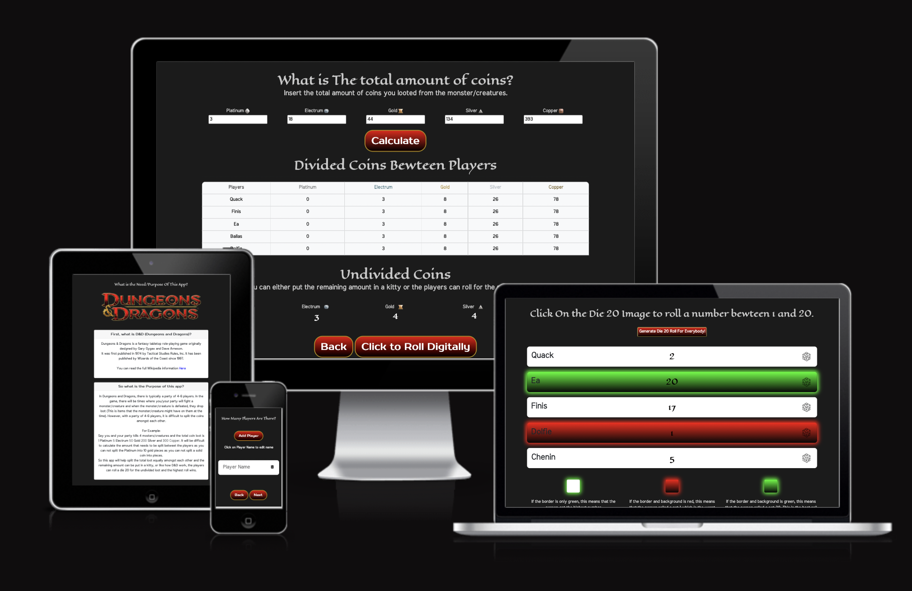

## What is Quack's Coin Divider?

First let me explain what D&D is,
Dungeons & Dragons is a fantasy tabletop role-playing game originally designed by Gary Gygax and Dave Arneson.
It was first published in 1974 by Tactical Studies Rules, Inc. It has been published by Wizards of the Coast since 1997.
 
You can read the full Wikipedia information [Here](https://en.wikipedia.org/wiki/Dungeons_%26_Dragons)

## Why "Quack's Coin Divider"?

What's with the name?  
I like to believe that I'm an avid gamer, and in all the games a play, my username (Gamer's Tag) is always 'Quack', and I thought that because I'm creating the site that involves gaming... It only seemed fitting. Also, because the application is designed to divide the entered coins, that's where the 'coin divider' part of the name comes in.

The Application can be viewed live by [clicking on this link!](https://quack842.github.io/quacks-coin-divider/)

# Table Of Contents

1. [User Experience (UX)](#user-experience-ux)
    * [Project Goals](#project-goals)
    * [User Goals](#user-goals)
    * [Color Scheme](#color-scheme)
    * [Typography](#typography)
    * [Wireframes](#wireframes)
2. [Features](#features)
3. [Technologies Used](#technologies-used)
    * [Languages](#languages-used)
    * [Frameworkds, Libraries, Website and Programs](#frameworks-libraries-websites-and-programs-used)
4. [Testing](#testing)
    * [Responsive Test](#responsive-test)
    * [Validating The Code](#validating-the-code)
    * [Accessibility](#accessibility)
5. [Deployment](#deployment)
6. [End Product](#end-product)

# User Experience (UX)
[Back To Top](#quacks-coin-divider)  
[Back To Table Of Contents](#table-of-contents)

## Project Goals

In Dungeons and Dragons, there is typically a party of 4-6 players. In the game, there will be times where you/your party will fight a monster/creature and when the monster/creature is defeated, they drop loot (This is items that the monster/creature might have on them at the time). However, with a party of 4-6 players, it is difficult to split the coins amongst each other.

<b>For Example:</b>

Let's say you and your party (5 People) kills 4 mosters/creatures and the total coin loot is <b>1</b> Platinum, <b>9</b> Electrum, <b>15</b> Gold, <b>143</b> Silver and <b>354</b> Copper. It will be difficult to calculate the amount that needs to be split between the players as you can not split the Platinum into 10 gold pieces as you can not split a solid coin into pieces.
So this app will help split the total loot equally amongst each other and the remaining amount can be put in a kitty, or like how D&D work, the players can roll a die 20 for the undivided loot and the highest roll wins.

The point of this application is to make it easier for players to divide the currect amount of coins amongst each other.

## User Goals

* The user will be able to navigate easily throughout the site and understand all the contents that is provided.
* It will be clear to the user what they can do and how they can do it.
* The user will be able to add a player, change the name and delete the player.
* After the Player page, the user will be able to enter a value (The coins that was collected) into each of the input boxes that is provided.
* When the user click on 'Calculate' It will show the coins divided amongst the players if possible, otherwise it will show the remaining amount in the 'Undivided Amount' section.
* The user will have the option to roll a die 20 for each of the players that was entered in the beginning.
* The user will also be able to access the website from any device with access to a browser, i.e Smartphone, Tablet and/or a Computer and the website will be responsive to said device.

## Color Scheme

The Main Colors that were chosen for this application was based off of the colors you'd see on the [D&D Beyond](https://www.dndbeyond.com/) website. This website is a very popular website for dungeons and dragons geeks. The Red and Dark Gray (almost black) idea came from the D&D website, the gold color felt like it was the best fit for the Red and black colors.  
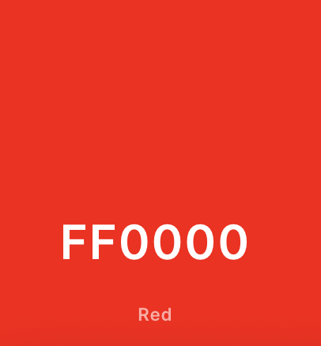
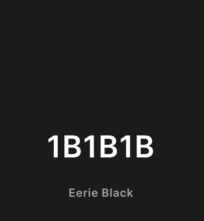 
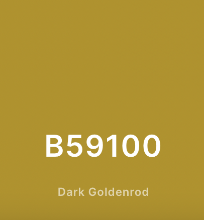

For the page where the user can roll for the remaining coins, if the a player get a nat 20 (natural 20), the background will change to a bright green color.  
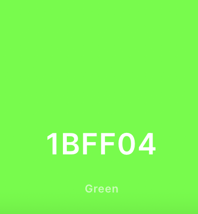

## Typography

The Main font that is used for this website is Eagle Lake and the secondary font is Meera Inimai. The font that was used for the normal text is Prosto One. The font, sans-serif, is used as a back-up font for in case the user's browser does not support the main and secondary fonts. The website [Google Fonts](https://fonts.google.com/) was used to select and import the fonts.
[Font Joy](https://fontjoy.com/) was used to help choose a font that is best paired with the main Eagle Lake font.

The website [Font Awesome](https://fontawesome.com/) was used for the icons.

## Wireframes

The Application [Balsamiq](https://balsamiq.com/) was used to create the basic idea and layout for the Application as suggested by code institute.

    
Home Page

    
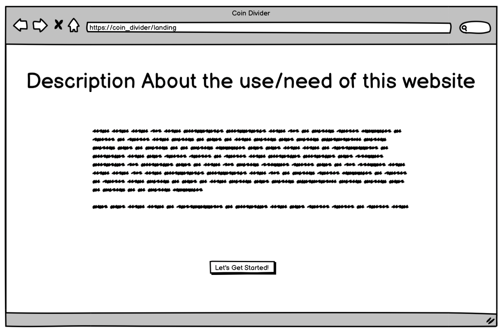  
The landing page is a simple page that explains what D&D is and what the use is of the application. There is also a link to the wikipidia page that explains in details what Dungeons and Dragons is. On the landing page is also the Dungeon and Dragons Logo that you will also find on the D&D Beyond website.

    
Players Page

    
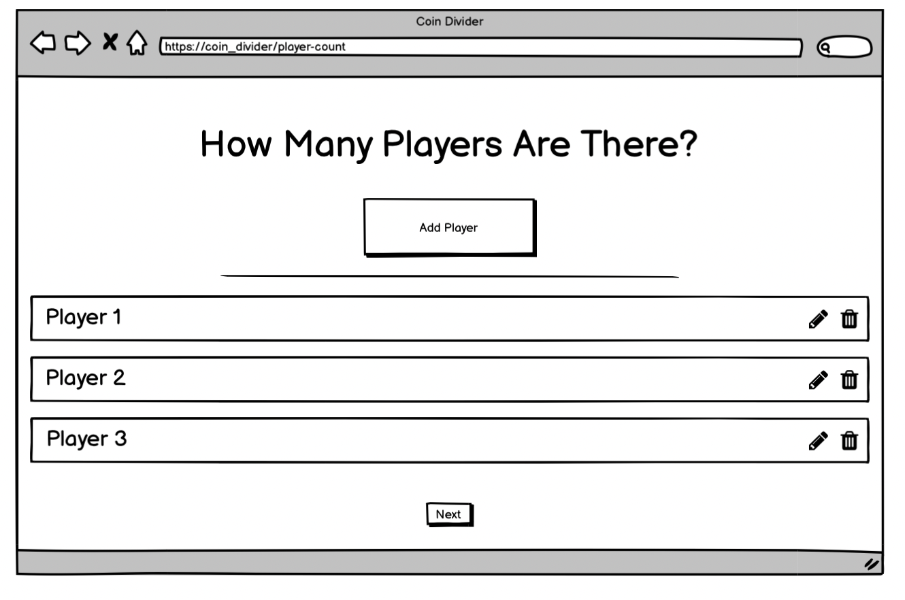  
The Players Page Has a simple design where the user can add and remove players. When the user click on the Add Player button, field will be added where the user can enter any name they want. This name that they enter will be pushed to an array in the background, this will be used on the next page. The user will also be able to remove a player by clicking on the trash icon. When the user click on the trash Icon, the player will be removed from the array in the background.
The user will not be able to go to the next page if they have not entered a name.

    
Calculations Page

    
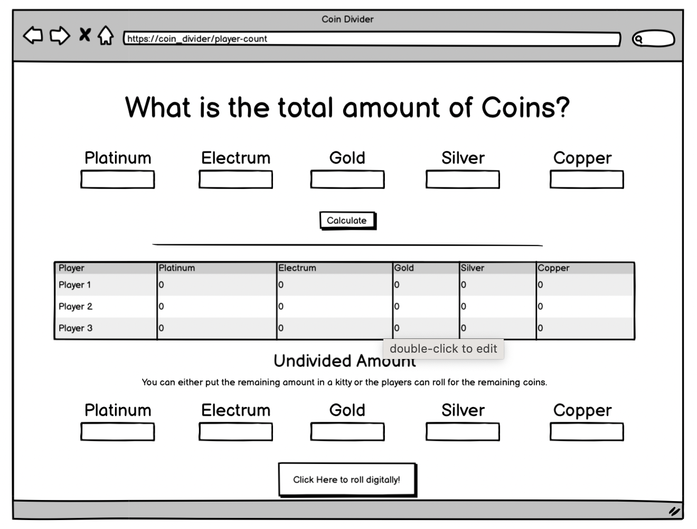  
The Calculations page is not a separate page but a different section that is hidden by default. When the user click on the next button on the Players page, the player page will be set to hidden and the calculations page will be shown.

On the Calculations page, the user will be able to enter the total amount of coins that the party has accumulated by defeating the creatures/monsters. When the user click the 'Calculate' button, a table will appear that shows the divided amount to each of the players that was added on the previous page.

The Remaining amount that could not be divided amongst the players, will be shown at the bottom of the page.

    
Roll Digitally Page

    
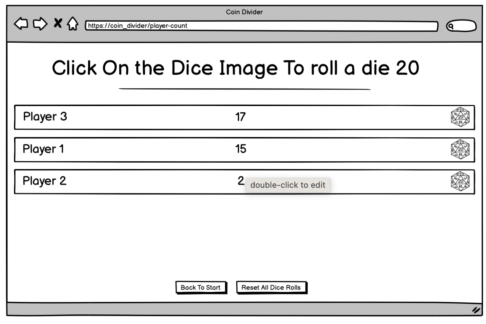  
The Roll Digitally Page is also hidden by default and when the 'Click To Roll Digitally' button is clicked, the Calculations Page and Player Page will be hidden and the Roll Digitally page will be shown.

When the user click on the 'Generate...' button, each of the playeres that was entered at the beginning will have a random number rolled. Originally, I wanted the player name to be re-arranged from the highest to smallest number, but decided to add a color to the highest number instead of re-arranging the players.

There is also a short discription on what each of the colors mean.

  

# Features
[Back To Top](#quacks-coin-divider)  
[Back To Table Of Contents](#table-of-contents)

## Existing Features
    

    
Players Page - Add Player

    The user will be able to add a player by clicking on the 'Add Player' button. The user will also be able to edit the players names as well as remove a player incase they accidently added to many or doesn't need the player anymore.
    There will also be two buttons on the bottom of the page that will allow the user to go back a page or go to the next page.
 
    The next button will hide the player page and show the calculations page while still keeping the Roll Page hidden.
   
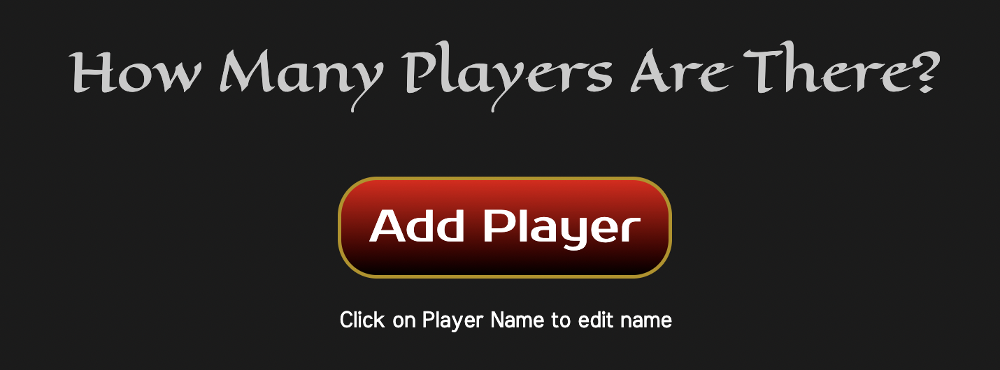  
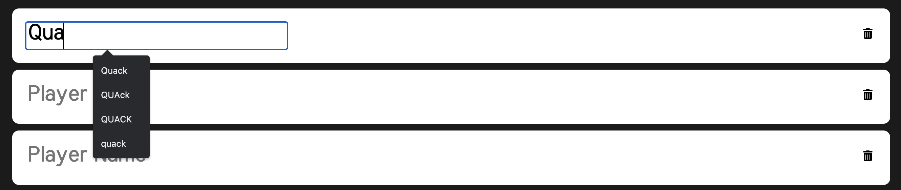  
  

     

    
Calculations Page - Coins Input

    After the User clicked on the next button, they will be able to insert the total accumulated coins into the provided input boxes. 
    Only after the user click on the Calculation button, the players that the user has created on the players page, will be displayed in a table with the divided amount amongst them.
     
    The amount of coins that could not be divided amongst each player will be displayed in the 'Undivided Amount' section. The user can then decide if they want to do one of the following:

1.  Put the remaining amount in a kitty (a bag with coins used to pay for inns and party related items)
2.  Roll a die 20 in real life to decide who gets the remaining amount.
3.  Roll digitally for each player to decide who gets the remaining amount.

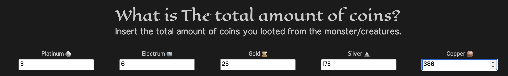  
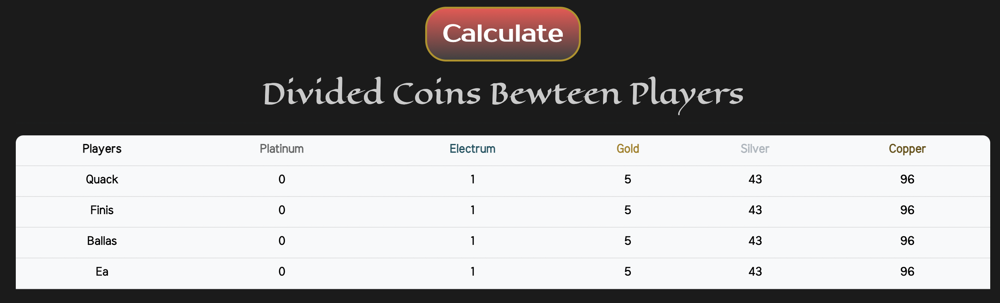  
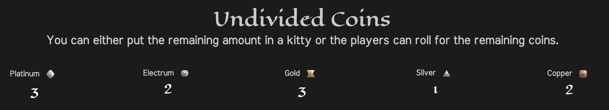  

     

    
Roll Page - Generating Rolls

    When the user click on the Generate button, the players that was entered on the Player page, will appear and a number between 1 and 20 will be displayed by each players name. 
     
    If a player rolls a 1, The background and border will turn red because typically rolling a 1 in D&D is very bad, but a green border will still be displayed on the player that rolled the highest.
     
    If a player rolls a 20, The background and border will turn green because rolling a 20 is a very good! 
     
    If there is no players that got a 1 or 20, the highest number will be displayed, which will indicates the winner.
     
    The generating function is desinged in such a way that will insure that there are no repeats of numbers. In Real life if all 5 players roll a die 20, there will be a chance that some players might roll the same number, and will have to roll again to see who wins. This function will prevent that.
     
     
    At the very bottom of the page, there will be 2 buttons. One for going back a page (the 'Back' Button) and the other one is to reset and go back to the very beginning of the aapplication (the 'Reset Everything' button).
    
  
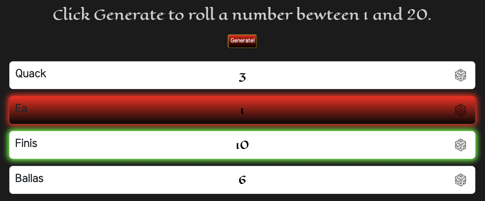  
  

 

# Technologies Used
[Back To Top](#quacks-coin-divider)  
[Back To Table Of Contents](#table-of-contents)

## Languages Used
* [HTML5](https://en.wikipedia.org/wiki/HTML5)  
Used for providing the core structure of the website pages.  

* [CSS3](https://en.wikipedia.org/wiki/CSS#CSS_3)  
Used for styling the HTML and Javascript documents  

* [JavaScript](https://en.wikipedia.org/wiki/JavaScript)  
Used to integrate specific features and create dynamic and interactive web content.

## Frameworks, Libraries, Websites and Programs Used
* [Google Fonts](https://fonts.google.com/)  
This Website was used to help choose the perfect fonts that will work together and to import the fonts onto the website.  

* [Font Awesome](https://fontawesome.com/)  
This website helped with using icons to give the website a betting user experience.  

* [GitPod](https://www.gitpod.io/)  
This website was used as a developers platform for writing code, committing the code and to push it to Github.  

* [Github](https://github.com/)  
This website is used to store code and make it possible for developers to commit and push code. This website also allows the Developer to share code with other developers.

* [Balsamiq](https://balsamiq.com/)  
This application was suggested by Code Institute to use for planning and creating a wireframe for the website.  

* [Reverso](https://www.reverso.net/spell-checker/english-spelling-grammar/)  
I used this website to help with the spelling and grammer.

* [Bootstrap](https://getbootstrap.com/)  
This website is a well known and used website by developers to help with coding and styling.

* [Box Shadow Generator](https://html-css-js.com/css/generator/box-shadow/)  
I used this website to help with creating a box shadow with certain specifications.

* [CSS Gradient](https://cssgradient.io/)  
Used this website to generate a gradient color into code that can be used in HTML5/CSS3.  

* [CorelDraw App](https://www.coreldraw.com/en/?link=wm)  
This App was used to reduse the size of the images.

* [StackOverflow](https://stackoverflow.com/)  
I used this website to help understand some of the Javascript functions.

* [CSS Button Generator](https://css3buttongenerator.com/)  
This website was usefull for designing the button and getting the code.

# Testing
[Back To Top](#quacks-coin-divider)  
[Back To Table Of Contents](#table-of-contents)  

## Responsive Test

I used [Responsive Design Checker](https://responsivedesignchecker.com/) to test if my website is responsive on all devices. Chrome DevTools was also used to check for responsiveness 

## Validating The Code
To validate the HTML on the website, I used [W3C Validator](https://validator.w3.org/#validate_by_input).

    

        Landing Page Validator
    

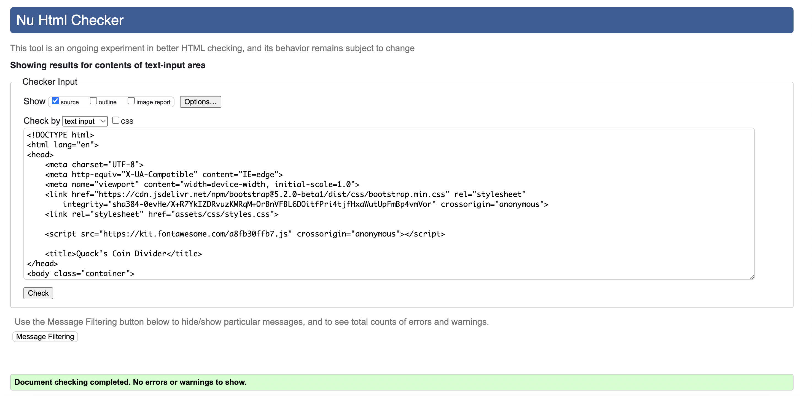

    

        Player Page Validator
    

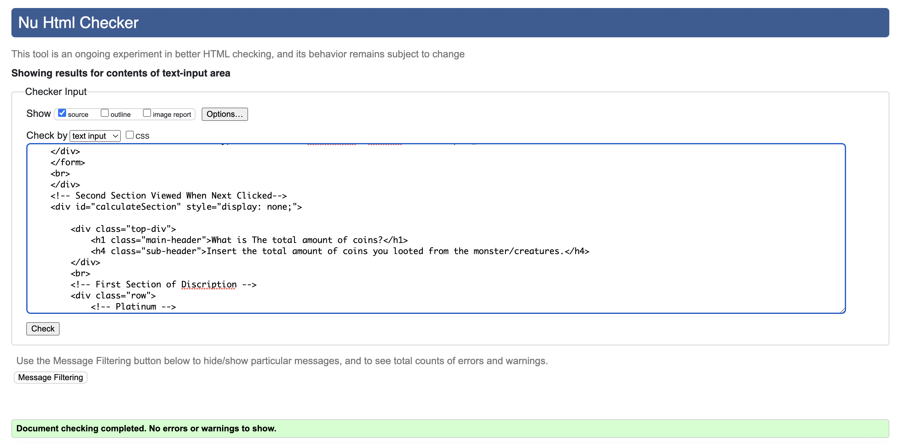

 

To validate the CSS code on the website, I used [Jigsaw Validator](https://jigsaw.w3.org/css-validator/#validate_by_input).
The CSS Page was tested and there were no errors.

    

        Styles Page Validator
    

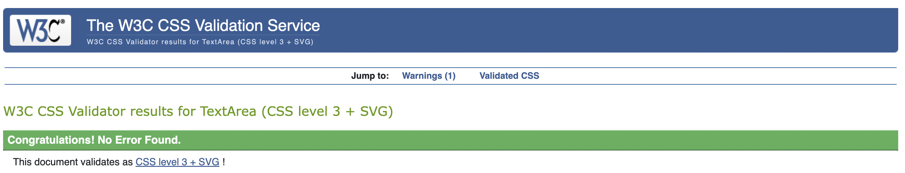

 

To validate the Javascript code on the website, I used [JSHint Validator](https://jshint.com/).
The Javascript Page was tested and there were no errors

    

        Javascript Page Validator
    

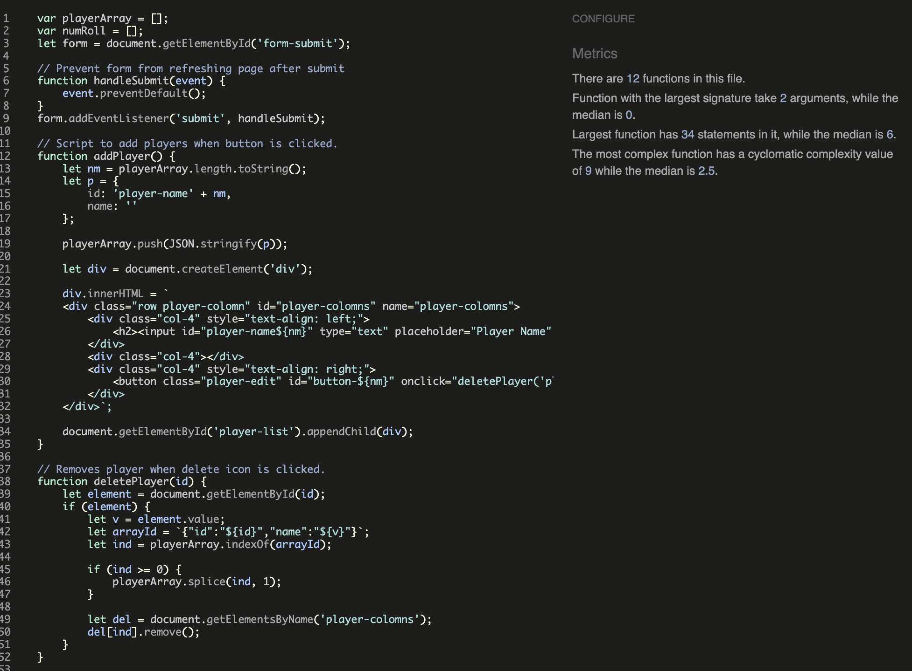

 

## Accessibility

The Lighthouse feature on Chrome DevTools was used to test the Accessibility of the three pages:

    

        Landing Page
    

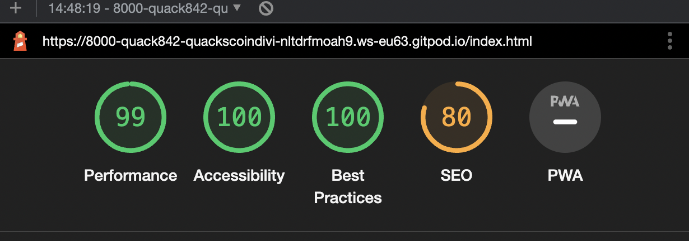

    

        Player Page
    

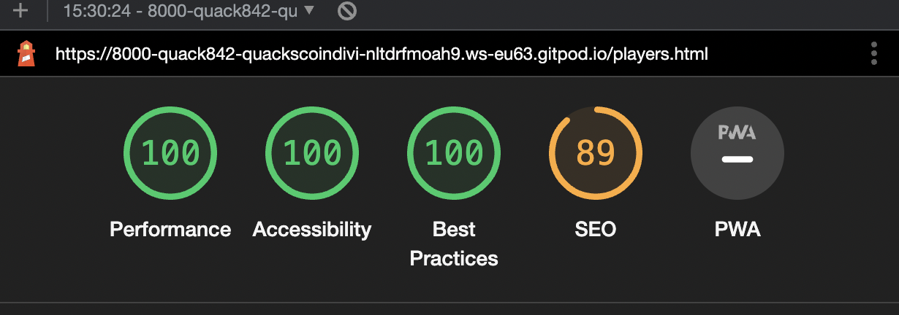

 

# Deployment
[Back To Top](#quacks-coin-divider)  
[Back To Table Of Contents](#table-of-contents)  

[GitPod](https://gitpod.io/) Was used for the development of the website.  
[GitHub](https://github.com/) was used to Host and Deploy the the website.
The following steps was taking to Deploy the website via Github:

1. Creating the Repository
    * Log into Github.
    * Locate the template that was provided by Code Institute. [Template](https://github.com/Code-Institute-Org/gitpod-full-template)
    * Click on the "Use This Template" on the top of the Repository.
    * Enter the name that was chosen for the website.
    * Clicked on the "Create repository from Template" button.
2. Deploying the Website.
    * In the GitHub repository, click on the "Settings" Tab.
    * Navigate to the "Pages" subsection from the left hand pannel.
    * Select the "main" branch and select the "Save" button.
    * Now a link has been generated for the Live Website.
 

# End Product
[Back To Top](#quacks-coin-divider)  
[Back To Table Of Contents](#table-of-contents)  

Landing Page

 The landing page is where the purpose of the application is explained as well as more information about Dungeons and Dragons in card form. It has a simple design and on the landing page is a image of the Dungeons and Dragons Logo.   

 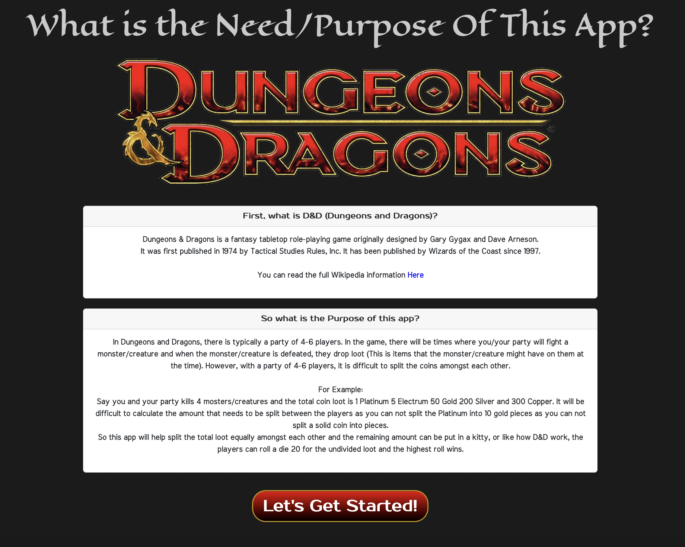

Player Page

On the Players page, the user will be able to add as many players as they want by clicking the 'Add player' button, and also be able to remove the players.
   

 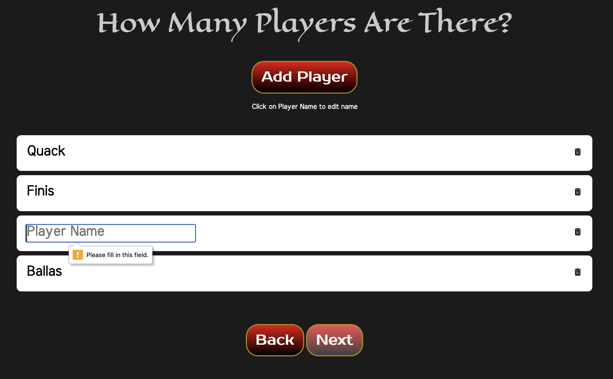

Calculate Page

On this page, the user will have to insert the total coins that was collected in each of the corresponding input boxes. After the user has entered the values into the boxes and click on the 'Calcualte' button, a table will appear with each players name (that the user has enetered on the Player Page) and the total amount of coins divided amongst all the layers.
   

 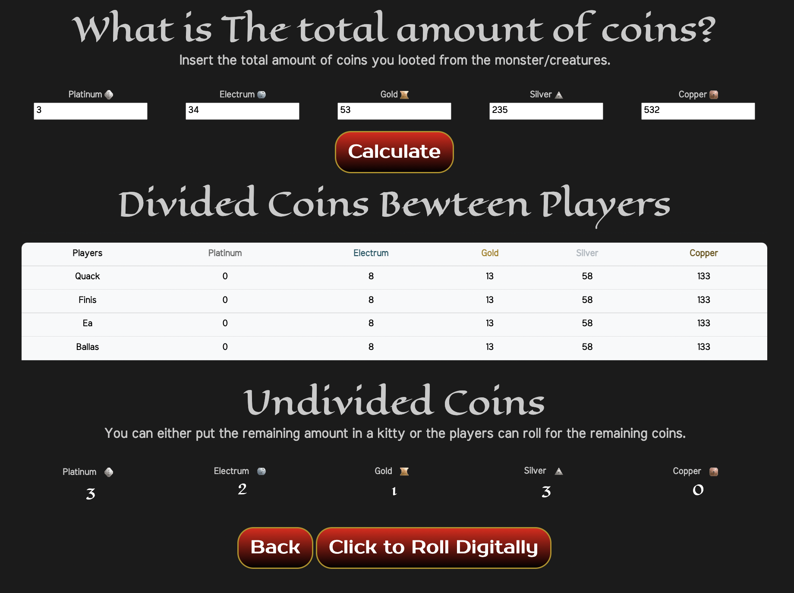
   
 https://user-images.githubusercontent.com/61915614/187947626-598948cb-fd3f-40ef-ab7b-b04e2388212d.mp4

Player Roll Page

This page will allow the user to roll a die 20 for each of the players that was entered on the Player Page.
   

  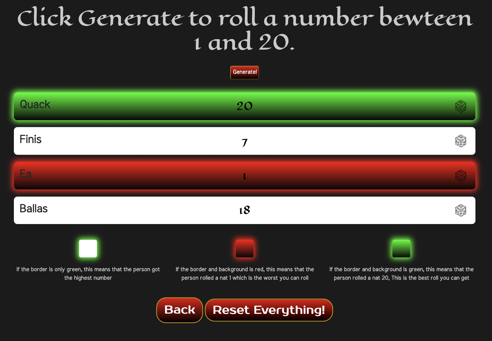
   
  https://user-images.githubusercontent.com/61915614/187947760-acc57a96-70b8-4a37-8423-b1c3af604fbc.mp4

